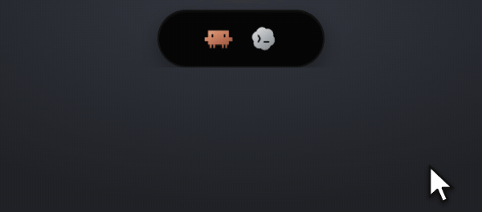
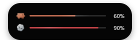
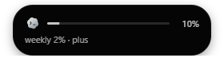

<p align="center">
  
</p>

<h1 align="center">Usage Pill</h1>

<p align="center">
  A tiny always-on-top overlay for real-time Claude Code / Codex usage.
</p>

<p align="center">
  <a href="https://www.npmjs.com/package/@mrayyan911/usage-pill"></a>
  
  
  
  
</p>

Usage Pill sits at the top of your screen, Dynamic-Island style, and shows
an animated bar, a percentage, and an agent badge for whichever of Claude
Code or Codex is mid-turn — one row normally, two stacked when both are
busy at once. Hover to expand it in place and see reset time, weekly
usage, and plan, or click an agent icon to inspect it directly.

## Features

- **Live usage for two agents.** Claude Code and Codex tracked
  independently, each with its own animated bar, percentage, and badge.
- **Dynamic-Island interaction.** Launches top-center, collapsed to an
  icon strip; hover expands it in place with reset time, weekly usage,
  and plan. Click an agent icon (or use the tray's **Show usage details**
  for keyboard access) to inspect it; **← Both** returns to the shared view.
- **Draggable, edge-aware placement.** Drag to any spot on any connected
  display; it hard-stops at the screen edge and reopens in the same spot
  next launch.
- **Meaningful state, not just a number.** A small **!** marks an agent
  waiting on a permission prompt; stale readings keep their last known
  percentage with a separate freshness label instead of silently going dark.
- **Cross-platform automatic startup.** An optional hidden background
  monitor (Windows, macOS, Linux) that appears only while a `claude` or
  `codex` session is open and disappears when the last one closes.
- **No build step, no framework.** The renderer is plain HTML/CSS/JS.

## Screenshots

Captured from a live-launched instance (`USAGE_PILL_MOCK=1`), not mockups.

| Collapsed | Expanded |
| --- | --- |
|  |  |
|  |  |

## Install

```sh
npm install -g @mrayyan911/usage-pill
usage-pill              # real data, always visible (manual preview)
usage-pill setup        # register a hidden monitor to launch at login
usage-pill monitor      # run that monitor manually, without registering it
usage-pill setup:remove # unregister it
```

### Run from source

```sh
npm install
npm start                    # real data, always visible (manual preview)
USAGE_PILL_MOCK=1 npm start  # scripted demo of every state, no waiting on real usage
USAGE_PILL_DEBUG=1 npm start # also logs every state change to the terminal
```

> [!TIP]
> `USAGE_PILL_MOCK=1 npm start` steps through every state and threshold on a
> timer — the fastest way to see what the pill looks like without waiting on
> real Claude/Codex usage.

## Automatic startup

Instead of running `npm start` yourself every time, Usage Pill can run as a
hidden background monitor that appears only while a `claude` or `codex`
session is open — one shared pill across every open terminal — and
disappears when the last one closes.

```sh
npm run setup         # register a hidden monitor to launch at login
npm run monitor        # run that monitor manually, without registering it
npm run setup:remove   # unregister it
```

This registers a login item on Windows, macOS (a `~/Library/LaunchAgents`
LaunchAgent), or Linux (an XDG `~/.config/autostart` entry), then launches
the monitor — the part that watches for an open `claude`/`codex` session and
shows/hides the pill. A tray icon offers **Pause automatic display**,
**Resume**, **Show preview**, **Show usage details**, and **Quit**. Scripted
runs (`codex exec`, `claude -p`) count as sessions; `--help`/`--version`/
utility subcommands and Claude Desktop do not.

> [!NOTE]
> The macOS/Linux paths are implemented and unit-tested against current
> Electron/XDG documentation but haven't yet been exercised on real
> macOS/Linux hardware.

## How it works

The whole app is one data pipeline:

```
ActivityStore.poll()  ──┐
                         ├──> Reducer._tick() ──> reduce() ──> onChange ──> IPC 'pill:state' ──> pill.js render()
UsageStore (Claude/Codex)┘
```

Activity and usage are tracked independently per agent, then merged into one
render-able state roughly every 400ms — one row when a single agent is
active, two when Claude and Codex are both mid-turn at once.

- **Claude's activity** comes primarily from a Claude Code hook
  (`hooks/activity-hook.js`) that distinguishes "blocked on a permission
  prompt" from "tool running" — something a transcript alone can't. Without
  a hook installed, or for any turn recorded before one is, the app falls
  back to tailing the session transcript directly, so it works out of the
  box either way. Claude's usage percentage comes from the same OAuth
  session Claude Code itself uses (`~/.claude/.credentials.json`), refreshed
  on a schedule plus right after each turn completes.
- **Codex** has no equivalent turn-start hook, so both its activity and its
  usage percentage come from tailing the newest session rollout file under
  `~/.codex/sessions/`.

See [CLAUDE.md](./CLAUDE.md) for the full internals (staleness handling,
dual-agent ordering, Windows-specific Electron transparency/drag gotchas,
and more) and [CONTEXT.md](./CONTEXT.md) for the project's domain
vocabulary.

## Testing

```sh
npm test              # 149 unit tests — pure functions, no Electron runtime needed
npm run test:renderer # 3 tests — real Electron animation/interaction regression
```

`npm test` covers the parsers (against scrubbed captured payload fixtures),
the activity-log state machine, drag/hover/placement math, the reducer
(including the two-agents-busy-at-once case), Windows/macOS/Linux session
detection and login-item registration, and the CLI subcommand→flag mapping
shared by `bin/usage-pill.js` and `scripts/manage-startup.js`.

## Status

> [!NOTE]
> - **macOS/Linux unverified on real hardware** — session detection and
>   login-item registration are implemented and unit-tested against current
>   Electron/XDG documentation, but not yet run on an actual Mac or Linux
>   machine.
> - **Multi-monitor and fullscreen-app stacking** are best confirmed by
>   running the pill yourself on your own display setup; the unit suite
>   covers logic, not every possible desktop configuration.

Manually verified on Windows (2026-09-23): launched from a live instance
(collapsed/expanded, one- and two-agent rows, real percentages and badges),
confirmed against the visual source of truth — see the screenshots above,
captured from that same run.
